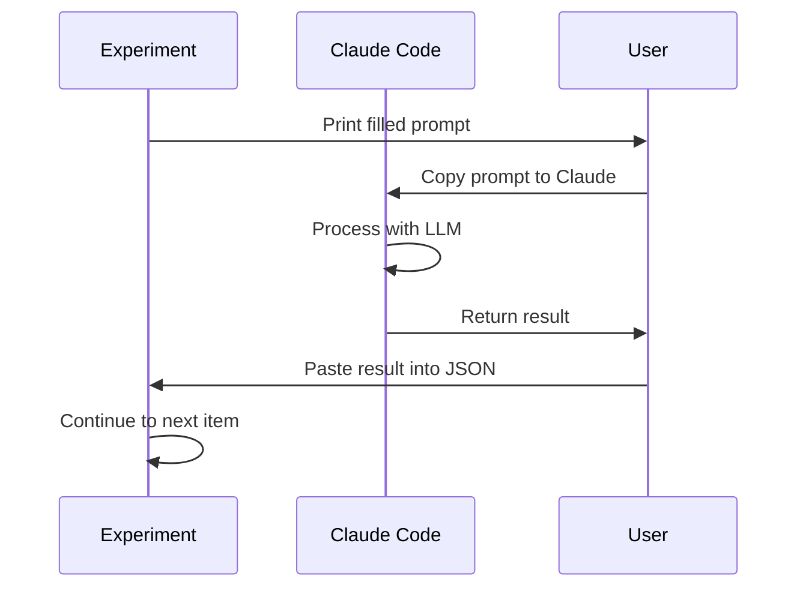

# 🤖 Inference Integration - LLM Processing

How to integrate LLM inference (Claude Code, OpenAI, etc.) into your experiments **out of the box**.

---

## Built-In: Claude Code Integration

The framework is designed to work **seamlessly with Claude Code** - no external API needed!

### How It Works



### Example: Prompt Testing with Claude Code

```typescript
// src/run_experiment.ts

async function runExperiment() {
  for (const variant of variants) {
    console.log(`\n=== Variant: ${variant.name} ===\n`);

    for (const item of testData) {
      // Fill prompt template
      const prompt = variant.prompt
        .replace('{content}', item.content)
        .replace('{title}', item.title);

      console.log('─'.repeat(60));
      console.log(`📝 Item ${item.id}:`);
      console.log('─'.repeat(60));
      console.log(prompt);
      console.log('─'.repeat(60));
      console.log('\n⏸️  PAUSE: Use Claude Code to:');
      console.log('   1. Copy the prompt above');
      console.log('   2. Get Claude\'s response');
      console.log('   3. Press Enter to continue\n');

      // Wait for user to process manually
      await new Promise(resolve => {
        process.stdin.once('data', resolve);
      });

      // User pastes result into results.json
      // Or you can prompt for input here:
      console.log('📥 Paste Claude\'s response (JSON):');
      const response = await getUserInput();

      results.push({
        variant: variant.name,
        itemId: item.id,
        input: item,
        output: JSON.parse(response),
        timestamp: new Date().toISOString(),
      });
    }
  }
}
```

### Tag Optimization Example

**How it was run with Claude Code:**

```typescript
// experiments/tag-optimization/run_experiment.ts

for (const card of testCards) {
  const prompt = PLATFORM_AWARE_PROMPT
    .replace('{platform}', card.metadata?.platform || 'unknown')
    .replace('{content}', card.content);

  console.log(`\n=== Card ${card.id} ===`);
  console.log(prompt);
  console.log('\n🤖 Claude Code: Generate tags for this content');

  // Manually copy prompt to Claude Code
  // Claude generates tags
  // Manually paste result into experiment_results.json
}
```

**Advantages:**
- ✅ No API costs (uses your Claude Code session)
- ✅ Full control over each generation
- ✅ Can inspect/modify responses in real-time
- ✅ No rate limits
- ✅ Works offline (if you have local Claude)

---

## Option 2: Automated with OpenAI API

For fully automated experiments, integrate OpenAI or Anthropic API:

### Setup

```bash
# Add to .env
OPENAI_API_KEY=sk-...
MODEL=gpt-4-turbo
TEMPERATURE=0.7
MAX_TOKENS=500
```

### Install Dependencies

```bash
bun add openai  # or @anthropic-ai/sdk
```

### Implementation

```typescript
// src/run_experiment.ts
import OpenAI from 'openai';

const openai = new OpenAI({
  apiKey: process.env.OPENAI_API_KEY,
});

async function processWithLLM(prompt: string, config: any) {
  const response = await openai.chat.completions.create({
    model: config.model || 'gpt-4-turbo',
    messages: [{ role: 'user', content: prompt }],
    temperature: config.temperature || 0.7,
    max_tokens: config.max_tokens || 500,
  });

  return response.choices[0].message.content;
}

async function runExperiment() {
  for (const variant of variants) {
    for (const item of testData) {
      const prompt = fillTemplate(variant.prompt, item);

      // Automated LLM call
      const output = await processWithLLM(prompt, variant.params);

      results.push({
        variant: variant.name,
        itemId: item.id,
        input: item,
        output: JSON.parse(output),
        timestamp: new Date().toISOString(),
      });
    }
  }
}
```

---

## Option 3: Anthropic Claude API

### Setup

```bash
# Add to .env
ANTHROPIC_API_KEY=sk-ant-...
MODEL=claude-sonnet-4-5-20250929
```

### Install

```bash
bun add @anthropic-ai/sdk
```

### Implementation

```typescript
// src/run_experiment.ts
import Anthropic from '@anthropic-ai/sdk';

const anthropic = new Anthropic({
  apiKey: process.env.ANTHROPIC_API_KEY,
});

async function processWithClaude(prompt: string, config: any) {
  const message = await anthropic.messages.create({
    model: config.model || 'claude-sonnet-4-5-20250929',
    max_tokens: config.max_tokens || 1024,
    messages: [{ role: 'user', content: prompt }],
  });

  return message.content[0].text;
}

async function runExperiment() {
  for (const variant of variants) {
    for (const item of testData) {
      const prompt = fillTemplate(variant.prompt, item);

      // Call Claude API
      const output = await processWithClaude(prompt, variant.params);

      results.push({
        variant: variant.name,
        itemId: item.id,
        input: item,
        output: JSON.parse(output),
        timestamp: new Date().toISOString(),
      });
    }
  }
}
```

---

## Option 4: Hybrid (Manual + Automated)

**Best of both worlds:**

```typescript
// src/run_experiment.ts

const USE_API = process.env.USE_API === 'true';

async function processItem(item: any, variant: any) {
  const prompt = fillTemplate(variant.prompt, item);

  if (USE_API) {
    // Automated via API
    console.log(`⚡ Processing ${item.id} with ${variant.name} (API)...`);
    return await callLLMAPI(prompt, variant.params);
  } else {
    // Manual via Claude Code
    console.log('\n' + '─'.repeat(60));
    console.log(`📝 Item ${item.id} - ${variant.name}`);
    console.log('─'.repeat(60));
    console.log(prompt);
    console.log('─'.repeat(60));
    console.log('\n🤖 Use Claude Code to process this prompt\n');

    await waitForEnter();
    const response = await getUserInput('Paste result: ');
    return JSON.parse(response);
  }
}
```

**Usage:**
```bash
# Manual mode (default)
bun run run

# Automated mode
USE_API=true bun run run
```

---

## Comparison: Manual vs Automated

| Aspect | Claude Code (Manual) | API (Automated) |
|--------|---------------------|-----------------|
| **Cost** | Free (your session) | $0.003-0.015/req |
| **Speed** | Slower (human-in-loop) | Fast (parallel) |
| **Control** | Full (inspect each) | Automated |
| **Rate Limits** | None | Yes (RPM/TPM) |
| **Offline** | Yes (local Claude) | No (needs internet) |
| **Best For** | Small experiments (< 50 items) | Large experiments (100+ items) |

---

## Timeout Configuration by Method

### Manual (Claude Code)

```typescript
// src/run_experiment.ts

const MANUAL_TIMEOUT = 5 * 60 * 1000; // 5 min per item

async function waitForInput(timeoutMs: number) {
  return new Promise((resolve, reject) => {
    const timeout = setTimeout(() => {
      reject(new Error('Manual input timeout'));
    }, timeoutMs);

    process.stdin.once('data', () => {
      clearTimeout(timeout);
      resolve();
    });
  });
}
```

### Automated (API)

```typescript
// src/run_experiment.ts

const API_TIMEOUT = 30 * 1000; // 30 sec per request

async function callWithTimeout(fn: () => Promise<any>, timeoutMs: number) {
  return Promise.race([
    fn(),
    new Promise((_, reject) =>
      setTimeout(() => reject(new Error('API timeout')), timeoutMs)
    )
  ]);
}

// Usage
const result = await callWithTimeout(
  () => processWithLLM(prompt, config),
  API_TIMEOUT
);
```

---

## Cost Estimation

### Manual (Claude Code)
- **Cost**: $0 (uses your session)
- **Time**: ~2-5 min per item
- **Best for**: 5-25 items × 3-4 variants = 15-100 total

### OpenAI API
- **GPT-4 Turbo**: $0.01/1K input + $0.03/1K output
- **Example**: 100 items × 500 tokens avg = $2-5 total
- **Best for**: 50+ items, need speed

### Anthropic Claude API
- **Claude Sonnet**: $0.003/1K input + $0.015/1K output
- **Example**: 100 items × 500 tokens avg = $1-3 total
- **Best for**: 50+ items, best quality

---

## Template Enhancement

Add to `src/run_experiment.ts`:

```typescript
// === INFERENCE CONFIGURATION ===

interface InferenceConfig {
  method: 'manual' | 'openai' | 'anthropic';
  timeout?: number;
  retries?: number;
  batchSize?: number;
}

const INFERENCE: InferenceConfig = {
  method: (process.env.INFERENCE_METHOD || 'manual') as any,
  timeout: parseInt(process.env.INFERENCE_TIMEOUT || '30000'),
  retries: parseInt(process.env.INFERENCE_RETRIES || '3'),
  batchSize: parseInt(process.env.BATCH_SIZE || '5'),
};

// === INFERENCE HANDLERS ===

async function processWithInference(item: any, variant: any) {
  const prompt = fillTemplate(variant.prompt, item);

  switch (INFERENCE.method) {
    case 'manual':
      return await manualInference(prompt);
    case 'openai':
      return await openaiInference(prompt, variant.params);
    case 'anthropic':
      return await anthropicInference(prompt, variant.params);
    default:
      throw new Error(`Unknown inference method: ${INFERENCE.method}`);
  }
}

async function manualInference(prompt: string) {
  console.log('\n' + '─'.repeat(60));
  console.log('🤖 Claude Code Prompt:');
  console.log('─'.repeat(60));
  console.log(prompt);
  console.log('─'.repeat(60));
  console.log('\nPress Enter after processing...');

  await waitForEnter();
  console.log('Paste result (JSON): ');
  return await getUserInput();
}

async function openaiInference(prompt: string, params: any) {
  const openai = new OpenAI({ apiKey: process.env.OPENAI_API_KEY });

  const response = await openai.chat.completions.create({
    model: params.model || 'gpt-4-turbo',
    messages: [{ role: 'user', content: prompt }],
    temperature: params.temperature || 0.7,
    max_tokens: params.max_tokens || 500,
  });

  return response.choices[0].message.content;
}

async function anthropicInference(prompt: string, params: any) {
  const anthropic = new Anthropic({ apiKey: process.env.ANTHROPIC_API_KEY });

  const message = await anthropic.messages.create({
    model: params.model || 'claude-sonnet-4-5-20250929',
    max_tokens: params.max_tokens || 1024,
    messages: [{ role: 'user', content: prompt }],
  });

  return message.content[0].text;
}

// Helper functions
async function waitForEnter() {
  return new Promise(resolve => process.stdin.once('data', resolve));
}

async function getUserInput(prompt?: string) {
  if (prompt) console.log(prompt);
  return new Promise<string>(resolve => {
    process.stdin.once('data', data => resolve(data.toString().trim()));
  });
}
```

---

## .env Configuration

```bash
# Inference method
INFERENCE_METHOD=manual  # manual | openai | anthropic

# Timeouts
INFERENCE_TIMEOUT=30000  # 30 seconds per item
MANUAL_TIMEOUT=300000    # 5 minutes for manual

# API keys (if using automated)
OPENAI_API_KEY=sk-...
ANTHROPIC_API_KEY=sk-ant-...

# Model configuration
MODEL=gpt-4-turbo        # or claude-sonnet-4-5-20250929
TEMPERATURE=0.7
MAX_TOKENS=500

# Batch processing
BATCH_SIZE=5             # Items to process in parallel (API only)
RATE_LIMIT=10            # Max requests per minute
```

---

## Recommended Workflow

### For Small Experiments (< 25 items)

**Use Claude Code (manual)**:
- ✅ No cost
- ✅ Full control
- ✅ Inspect each result
- ⏱️ Time: 1-2 hours

```bash
INFERENCE_METHOD=manual bun run run
```

### For Medium Experiments (25-100 items)

**Use Claude API (automated)**:
- ✅ Best quality
- ✅ Reasonable cost ($2-5)
- ✅ Fast (parallel processing)
- ⏱️ Time: 10-30 minutes

```bash
INFERENCE_METHOD=anthropic bun run run
```

### For Large Experiments (100+ items)

**Use OpenAI API (automated)**:
- ✅ Fastest
- ✅ Cost-effective at scale
- ✅ High rate limits
- ⏱️ Time: 5-15 minutes

```bash
INFERENCE_METHOD=openai BATCH_SIZE=10 bun run run
```

---

## Error Handling

```typescript
async function processWithRetry(
  item: any,
  variant: any,
  maxRetries: number = 3
) {
  for (let attempt = 1; attempt <= maxRetries; attempt++) {
    try {
      return await processWithInference(item, variant);
    } catch (error) {
      console.error(`❌ Attempt ${attempt}/${maxRetries} failed:`, error.message);

      if (attempt === maxRetries) {
        console.error(`⚠️  Skipping item ${item.id} after ${maxRetries} attempts`);
        return null;
      }

      // Exponential backoff
      const delay = Math.pow(2, attempt) * 1000;
      console.log(`⏳ Retrying in ${delay}ms...`);
      await new Promise(resolve => setTimeout(resolve, delay));
    }
  }
}
```

---

## Summary

**Out-of-the-box methods:**

1. **Claude Code (Manual)** ⭐ **Recommended for starting**
   - Zero setup, zero cost
   - Perfect for prototyping (5-25 items)
   - Full control and inspection

2. **OpenAI API (Automated)**
   - Best for speed and scale (100+ items)
   - Add `openai` package + API key

3. **Anthropic Claude API (Automated)**
   - Best quality results
   - Great for medium experiments (25-100 items)
   - Add `@anthropic-ai/sdk` + API key

**Choose based on:**
- **Budget**: Manual (free) → Anthropic ($) → OpenAI ($$)
- **Scale**: Manual (< 25) → Anthropic (25-100) → OpenAI (100+)
- **Quality**: Manual = Anthropic > OpenAI
- **Speed**: OpenAI > Anthropic > Manual

Start with Claude Code for your first experiment, then scale to API if needed! 🚀
