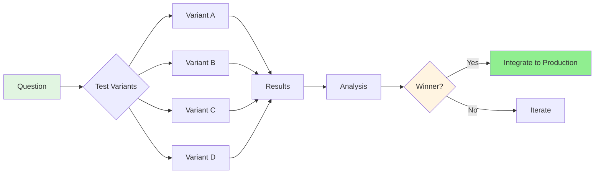
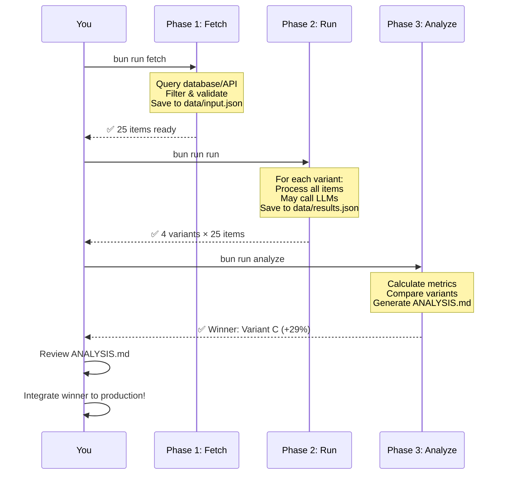
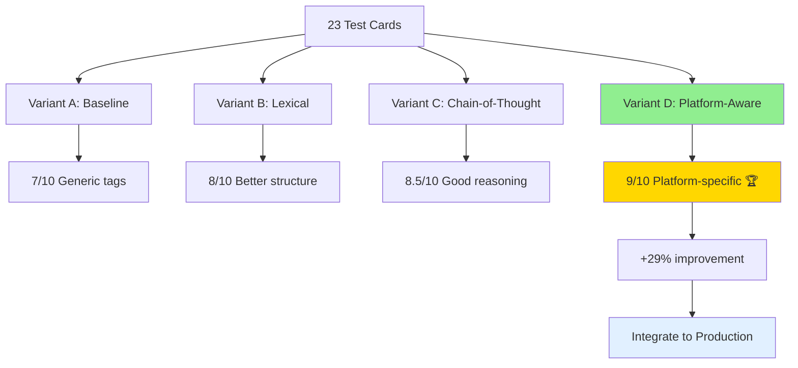
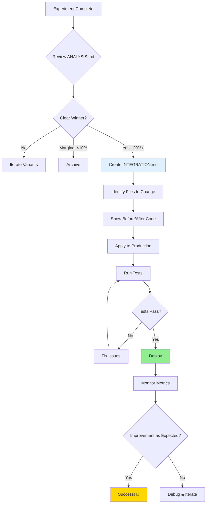

# 🔬 Universal Autoresearch Framework

> **Karpathy-inspired backbone for running systematic experiments with Claude Code**

A self-contained, reproducible pattern for testing **anything**: prompts, algorithms, parameters, models, or any variation you want to evaluate.

[](https://bun.sh)
[](https://www.typescriptlang.org/)
[](https://opensource.org/licenses/MIT)

---

## 🎯 What Is This?

A **universal experiment framework** that lets you systematically test variations and measure improvements:



**Real examples:**
- 🏷️ **Tag optimization**: 4 prompts → +29% better tags → 4 hours total
- 🤖 **Model comparison**: GPT-4 vs Claude vs Gemini → pick winner
- ⚙️ **Parameter tuning**: Temperature 0.3-1.0 → find sweet spot
- 📊 **Algorithm testing**: BM25 vs vector search → measure relevance

**Tag optimization is just one example** - this framework works for ANY experiment!

---

## ⚡ Quick Start (15 minutes)

```bash
# 1. Copy template for your experiment
cp -r experiments/_template experiments/my-experiment
cd experiments/my-experiment

# 2. Configure
cp .env.example .env
# Edit .env with API keys/credentials
bun install

# 3. Run
bun run fetch    # Phase 1: Collect data
bun run run      # Phase 2: Run variants
bun run analyze  # Phase 3: Generate analysis

# 4. Review
cat ANALYSIS.md  # See which variant won!
```

---

## 📊 The Three-Phase Workflow



### Phase 1: Fetch Data

**What it does**: Collects test data from your source (database, API, CSV, etc.)

**Typical duration**: 2-10 minutes

**Example** (Supabase):
```typescript
// src/fetch_data.ts
const { data } = await supabase
  .from('cards')
  .select('*')
  .limit(30)

// Saves to: data/input.json
```

### Phase 2: Run Experiment

**What it does**: Tests each variant against your dataset

**Typical duration**: 10-60 minutes (depends on LLM calls, processing)

**Example** (prompt testing):
```typescript
// src/run_experiment.ts
for (const variant of variants) {
  for (const item of testData) {
    const result = await processWithPrompt(item, variant.prompt)
    results.push({ variant: variant.name, result })
  }
}

// Saves to: data/results.json
```

### Phase 3: Analyze Results

**What it does**: Calculates metrics and identifies winner

**Typical duration**: 3-5 minutes (automated)

**Example**:
```typescript
// src/analyze_results.ts
const summary = {
  variant_a: { avg_score: 7.2, improvement: "baseline" },
  variant_b: { avg_score: 8.1, improvement: "+12%" },
  variant_c: { avg_score: 9.3, improvement: "+29%" }, // Winner!
}

// Saves to: ANALYSIS.md
```

---

## ⏱️ Timing & Duration Control

### Configure Experiment Duration

```typescript
// src/run_experiment.ts

interface ExperimentConfig {
  maxDuration?: number;       // Total timeout (ms)
  itemTimeout?: number;       // Per-item timeout (ms)
  batchSize?: number;         // Parallel processing
  delayBetweenItems?: number; // Rate limiting (ms)
}

// Example: 30-minute experiment
const config: ExperimentConfig = {
  maxDuration: 30 * 60 * 1000,  // 30 min total
  itemTimeout: 5 * 1000,         // 5 sec per item
  batchSize: 5,                  // 5 items in parallel
  delayBetweenItems: 100,        // 100ms between items
};
```

### Typical Timeline

```mermaid
gantt
    title Experiment Timeline (Small: 25 items × 4 variants)
    dateFormat X
    axisFormat %Mm

    section Setup
    Copy template :done, s1, 0, 600
    Configure .env :done, s2, 600, 900
    Define variants :done, s3, 900, 1800

    section Phase 1
    Fetch data :active, p1, 1800, 2100

    section Phase 2
    Variant A :crit, p2a, 2100, 2700
    Variant B :crit, p2b, 2700, 3300
    Variant C :crit, p2c, 3300, 3900
    Variant D :crit, p2d, 3900, 4500

    section Phase 3
    Analyze :p3, 4500, 4800

    section Review
    Manual review :review, 4800, 5700
```



**Time breakdown** (adjust based on your scale):
- **Setup** (one-time): 10-15 min
- **Phase 1** (Fetch): 2-10 min
- **Phase 2** (Run): 10-60 min
  - LLM calls: ~5-10 sec per item
  - 25 items × 4 variants = 100 calls = 8-16 min
- **Phase 3** (Analyze): 3-5 min
- **Review**: 15-30 min

**Total**: 40-120 minutes for a typical experiment

### Timeout Implementation

```typescript
// Global timeout
const EXPERIMENT_TIMEOUT = 30 * 60 * 1000; // 30 minutes

async function runExperiment() {
  const startTime = Date.now();

  for (const variant of variants) {
    for (const item of testData) {
      // Check timeout
      if (Date.now() - startTime > EXPERIMENT_TIMEOUT) {
        console.error('⏱️  Timeout reached! Saving partial results...');
        break;
      }

      await processItem(item, variant);
    }
  }
}

// Per-item timeout
async function processWithTimeout(item: any, timeout: number) {
  return Promise.race([
    processItem(item),
    new Promise((_, reject) =>
      setTimeout(() => reject(new Error('Item timeout')), timeout)
    )
  ]);
}
```

---

## 🏗️ Framework Architecture

### Directory Structure

```
experiments/
├── README.md                      # This file
├── CREATING_EXPERIMENTS.md        # Step-by-step guide
├── INTEGRATION_FLOW.md            # How to integrate winners
├── QUICK_START.md                 # 15-min quick start
│
├── _template/                     # 🎯 Universal template
│   ├── src/
│   │   ├── fetch_data.ts          # Customize: your data source
│   │   ├── variants.ts            # Customize: your variants
│   │   ├── run_experiment.ts      # Customize: processing logic
│   │   └── analyze_results.ts     # Customize: your metrics
│   ├── package.json               # Dependencies & scripts
│   ├── .env.example               # Configuration template
│   └── .gitignore                 # Security
│
└── your-experiment/               # Your copy of _template
    ├── data/
    │   ├── input.json             # Generated by Phase 1
    │   └── results.json           # Generated by Phase 2
    ├── ANALYSIS.md                # Generated by Phase 3
    └── INTEGRATION.md             # Created if winner found
```

### Template Scripts

```json
{
  "scripts": {
    "fetch": "bun run src/fetch_data.ts",
    "run": "bun run src/run_experiment.ts",
    "analyze": "bun run src/analyze_results.ts"
  }
}
```

---

## 🎨 Real-World Example: Tag Optimization

**Problem**: AI tags were too generic (`technology`, `code`, `developer`)

**Experiment**: Test 4 prompt variants



**Results**:
- **Winner**: Platform-aware prompting
- **Improvement**: +29% (7/10 → 9/10)
- **Time**: 2.5 hours (setup → analysis)
- **Integration**: 1 hour (applied to 2 files)

**See**: [`mymind-clone-web/experiments/tag-optimization/`](https://github.com/yourusername/mymind-clone-web/tree/main/experiments/tag-optimization) for complete example

---

## 🔄 Integration Flow



**Example integration** (tag optimization):

1. **Create `INTEGRATION.md`**:
   ```markdown
   ## Winner: Platform-Aware Prompting (+29%)

   ## Files to Modify
   - `/apps/web/lib/prompts/classification.ts` - Add platform prompts
   - `/apps/web/lib/ai.ts` - Add platform detection

   ## Before/After
   [Show code diffs]
   ```

2. **Apply changes**:
   ```typescript
   // classification.ts
   export function getPlatformAwarePrompt(platform?: string) {
     const guideline = PLATFORM_GUIDELINES[platform] || DEFAULT;
     return `Generate tags for ${platform} content:\n${guideline}`;
   }

   // ai.ts
   const platform = detectPlatform(url); // github, youtube, etc.
   const prompt = getPlatformAwarePrompt(platform);
   ```

3. **Test & deploy**:
   ```bash
   bun test  # Run tests
   git add apps/web/lib/*.ts
   git commit -m "feat: platform-aware tagging (+29%)"
   git push
   ```

---

## 🎯 When to Use This Framework

### ✅ Good Use Cases

- **Prompt engineering**: Test 3-5 variations systematically
- **Model comparison**: GPT-4 vs Claude vs Gemini
- **Parameter tuning**: Find optimal temperature/top_p
- **Algorithm testing**: BM25 vs vector vs hybrid search
- **Feature evaluation**: A/B test before production

### ❌ Not Suitable

- **One-off tests**: Use console/REPL instead
- **Production debugging**: Use logging/monitoring
- **Simple queries**: Use database dashboard
- **Real-time experiments**: This is offline analysis

---

## 🛠️ Customization Examples

### Change Data Source

```typescript
// Supabase (default)
const { data } = await supabase.from('cards').select('*').limit(30);

// REST API
const response = await fetch('https://api.example.com/data');
const data = await response.json();

// GraphQL
const { data } = await graphqlClient.query({ query: GET_ITEMS });

// Local CSV
const data = await readCSV('input.csv');
```

### Define Variants

```typescript
// Prompt variants
export const variants = [
  { name: 'baseline', prompt: 'Current prompt...' },
  { name: 'improved', prompt: 'Better prompt...' },
];

// Parameter variants
export const variants = [
  { name: 'low_temp', params: { temperature: 0.3 } },
  { name: 'high_temp', params: { temperature: 1.0 } },
];

// Algorithm variants
export const variants = [
  { name: 'bm25', fn: bm25Search },
  { name: 'vector', fn: vectorSearch },
  { name: 'hybrid', fn: hybridSearch },
];
```

### Custom Metrics

```typescript
// src/analyze_results.ts
function calculateMetrics(results: Result[]) {
  return {
    accuracy: results.filter(r => r.correct).length / results.length,
    avgLatency: results.reduce((sum, r) => sum + r.latency, 0) / results.length,
    improvement: ((current - baseline) / baseline) * 100,
    customMetric: yourMetricFunction(results),
  };
}
```

---

## 🔐 Security Best Practices

### ❌ Wrong: Hardcoded Credentials

```typescript
const supabase = createClient(
  'https://example.supabase.co',
  'eyJhbGci...' // Exposed in code!
);
```

### ✅ Right: Environment Variables

```typescript
// src/fetch_data.ts
const SUPABASE_URL = process.env.SUPABASE_URL!;
const SUPABASE_KEY = process.env.SUPABASE_SERVICE_KEY!;

if (!SUPABASE_KEY) {
  console.error('❌ Missing SUPABASE_SERVICE_KEY!');
  console.error('Create .env: cp .env.example .env');
  process.exit(1);
}

const supabase = createClient(SUPABASE_URL, SUPABASE_KEY);
```

### .gitignore (Built-in)

```gitignore
.env              # Never commit!
.env.local
data/             # May contain sensitive data
node_modules/
*.log
```

---

## 📚 Documentation

- **[QUICK_START.md](./QUICK_START.md)** - Get started in 15 minutes
- **[CREATING_EXPERIMENTS.md](./CREATING_EXPERIMENTS.md)** - Complete creation guide
- **[INTEGRATION_FLOW.md](./INTEGRATION_FLOW.md)** - From experiment to production
- **[IMPLEMENTATION_SUMMARY.md](./IMPLEMENTATION_SUMMARY.md)** - Technical details

---

## 🤝 Contributing

Improvements welcome! If you:
- Add useful utilities
- Create interesting experiments
- Find bugs or issues
- Have suggestions

Open an issue or PR!

---

## 📝 License

MIT - Use however you want!

---

## 🙏 Credits

Inspired by:
- **Andrej Karpathy**: Scientific rigor in ML experiments
- **FastAI**: Practical, accessible frameworks
- **Charm.sh**: Beautiful CLI tools and documentation

---

## 🚀 Get Started Now

```bash
# 1. Copy template
cp -r experiments/_template experiments/my-first-experiment

# 2. Configure
cd experiments/my-first-experiment
cp .env.example .env
# Edit .env with your credentials

# 3. Run
bun install
bun run fetch
bun run run
bun run analyze

# 4. Review
cat ANALYSIS.md  # See which variant won!
```

**Questions?** See [QUICK_START.md](./QUICK_START.md)

**Ready to experiment?** Copy the template and start testing! 🔬
