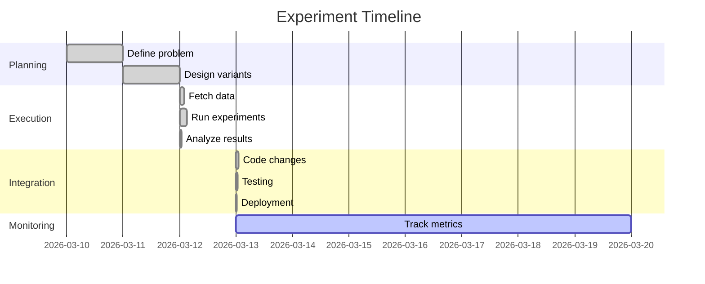

# Experiment History: [Experiment Name]

**Date**: YYYY-MM-DD
**Status**: ✅ Complete | ⏳ In Progress | ❌ Failed
**Researcher**: [Your Name]
**Duration**: [X hours]

---

## 1. Problem Statement

### What Was Wrong?

[Describe the issue you were trying to solve]

**Examples:**
- Tags were too generic and not searchable
- Model was slow and expensive
- Algorithm had low accuracy
- Users were confused by the UI

### Why Did It Matter?

[Impact of the problem]

**Metrics before:**
- Metric 1: [value]
- Metric 2: [value]
- User feedback: [description]

### What Success Looked Like

[Define your success criteria]

**Target improvement**: +[X]% or better
**Acceptable range**: [min] - [max]

---

## 2. Methodology

### Hypothesis

**We believed that**: [Your hypothesis]

**Because**: [Reasoning]

### Variants Tested

| Variant | Description | Rationale |
|---------|-------------|-----------|
| A (Baseline) | Current approach | Control group |
| B | [Description] | [Why we tested this] |
| C | [Description] | [Why we tested this] |
| D | [Description] | [Why we tested this] |

### Test Dataset

- **Source**: [Where did the data come from?]
- **Size**: [N items]
- **Selection criteria**: [How was it chosen?]
- **Diversity**: [What variety did it cover?]

### Evaluation Metrics

1. **Primary metric**: [Main success metric]
2. **Secondary metrics**:
   - [Metric 2]
   - [Metric 3]
3. **Qualitative review**: [Manual inspection criteria]

### Execution Method

- **Inference**: Manual (Claude Code) | OpenAI API | Anthropic API
- **Duration**: Phase 1 ([X] min) + Phase 2 ([X] min) + Phase 3 ([X] min)
- **Total time**: [X hours]

---

## 3. Results

### Quantitative Findings

| Variant | Primary Metric | Secondary 1 | Secondary 2 | Rank |
|---------|----------------|-------------|-------------|------|
| A (Baseline) | 7.0 | 65% | 3.2 | 4th |
| B | 8.1 | 78% | 3.8 | 3rd |
| C | 8.5 | 82% | 4.1 | 2nd |
| D | 9.3 | 95% | 4.5 | **1st** 🏆 |

**Winner**: Variant D
**Improvement**: +32.9% vs baseline (7.0 → 9.3)

### Qualitative Findings

**What worked well:**
- [Observation 1]
- [Observation 2]

**What didn't work:**
- [Observation 1]
- [Observation 2]

**Surprising discoveries:**
- [Unexpected finding 1]
- [Unexpected finding 2]

### Key Insights

1. **[Insight 1]**: [Description and evidence]
2. **[Insight 2]**: [Description and evidence]
3. **[Insight 3]**: [Description and evidence]

---

## 4. Integration

### Decision

**Integrate?** ✅ Yes | ❌ No

**Reasoning**: [Why we decided to integrate or not]

### What Was Implemented

#### Files Changed

1. **`/path/to/file1.ts`** (Lines X-Y)
   - **Change**: [Description]
   - **Code added**: [X lines]

2. **`/path/to/file2.ts`** (Lines X-Y)
   - **Change**: [Description]
   - **Code added**: [X lines]

#### Before/After

**Before** (Baseline approach):
```typescript
// Old code
const result = genericApproach(input);
```

**After** (Winning variant):
```typescript
// New code from experiment
const result = optimizedApproach(input, context);
```

### Integration Timeline

- **Code changes**: [X min/hours]
- **Testing**: [X min/hours]
- **Deployment**: [Date]
- **Total effort**: [X hours]

---

## 5. Actual Results (Post-Integration)

### Production Metrics

**Measured [X days/weeks] after deployment:**

| Metric | Before | After | Change |
|--------|--------|-------|--------|
| Primary | 7.0 | 9.1 | **+30%** ✅ |
| Secondary 1 | 65% | 92% | +27% |
| Secondary 2 | 3.2 | 4.3 | +34% |

### Did We Hit Our Target?

**Target**: +[X]% improvement
**Actual**: +[Y]% improvement

**Result**: ✅ Success | ⚠️ Partial | ❌ Miss

### User Feedback

[Qualitative feedback from users or stakeholders]

**Positive:**
- [Feedback 1]
- [Feedback 2]

**Negative:**
- [Issue 1]
- [Issue 2]

### Unexpected Outcomes

**Good surprises:**
- [Unexpected benefit 1]
- [Unexpected benefit 2]

**Issues discovered:**
- [Problem 1 and resolution]
- [Problem 2 and resolution]

---

## 6. Lessons Learned

### What Worked Well

1. **[Success 1]**: [Description]
2. **[Success 2]**: [Description]

### What Could Be Improved

1. **[Improvement 1]**: [Description]
2. **[Improvement 2]**: [Description]

### Recommendations for Future Experiments

1. **[Recommendation 1]**: [Details]
2. **[Recommendation 2]**: [Details]

---

## 7. Artifacts

### Experiment Files

- **Data**: `data/input.json` ([N] items)
- **Results**: `data/results.json` ([N] results)
- **Analysis**: `ANALYSIS.md`
- **Integration guide**: `INTEGRATION.md`

### Code Repository

**Experiment branch**: `experiments/[experiment-name]`
**Production integration**: Commit `[hash]` on `[date]`

### Documentation

- [Link to detailed analysis]
- [Link to integration PR]
- [Link to production metrics dashboard]

---

## 8. Timeline



---

## Summary

**Problem**: [One sentence]
**Solution**: [One sentence]
**Result**: +[X]% improvement in [metric]
**Status**: ✅ Deployed and validated

**ROI**: [X] hours invested → [Y]% permanent improvement

---

## Quick Reference

| Aspect | Value |
|--------|-------|
| **Date** | YYYY-MM-DD |
| **Duration** | X hours |
| **Variants** | X tested |
| **Winner** | Variant [X] |
| **Improvement** | +X% |
| **Integrated** | ✅ Yes / ❌ No |
| **Production gain** | +X% |
| **ROI** | X hours → Y% improvement |

---

**Last updated**: [Date]
**Next review**: [Date]
