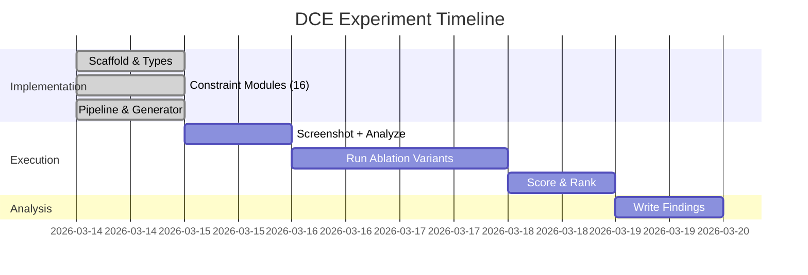

# Experiment History: Design Constraint Engine

**Date**: 2026-03-14
**Status**: In Progress
**Researcher**: autoresearch
**Duration**: TBD

---

## 1. Problem Statement

### What Was Wrong?

LLMs can build UIs from screenshots, but without pixel-precise specs they produce "close enough" designs that miss the craft. Screenshots alone aren't composable or debuggable. There's no machine-readable format that captures *why* a design looks right.

### Why Did It Matter?

- Design reproduction fidelity is inconsistent and hard to measure
- No way to isolate *which aspects* of a design contribute most to visual quality
- Builder LLMs lack structured, testable specifications

### What Success Looked Like

**Target**: Identify the minimum set of design dimensions that achieve >= 85% of maximum fidelity
**Methodology**: Ablation study across 16 CSS/DOM dimensions with 9 variants

---

## 2. Methodology

### Hypothesis

**We believed that**: A small subset of design dimensions (likely Tier 1: layout, spacing, sizing, typography) accounts for the majority of visual fidelity when reproducing a design.

**Because**: Structural properties define the skeleton of a UI. Surface (color, borders) and relational (alignment, composition) dimensions add polish but may not be necessary for "good enough" reproduction.

### Variants Tested

| Variant | Dimensions | Rationale |
|---------|-----------|-----------|
| all_16 (Control) | All 16 | Upper bound |
| tier1_only | 4 | Structural minimum |
| tier1_tier2 | 8 | Mid-range |
| no_color | 15 | Color contribution |
| no_spacing | 15 | Spacing contribution |
| no_typography | 15 | Typography contribution |
| layout_only | 1 | Absolute minimum |
| typography_color | 2 | Identity-only |
| tier3_only | 8 | Relational-only |

### Scoring Formula

```
FidelityScore = 0.3 * CPR + 0.4 * VDS + 0.3 * SSIM
```

- **CPR**: Constraint Pass Rate (passed/total Playwright assertions)
- **VDS**: Visual Diff Score (1 - diffPixelRatio via pixelmatch)
- **SSIM**: Structural Similarity (pixelmatch with tight threshold)

### Controls

- Same source design for all variants
- Same Builder LLM, temperature, and prompt structure
- Same viewport (1280x720)
- Same system fonts

---

## 3. Results

*To be filled after experiment execution.*

---

## 4. Integration

*To be filled after analysis.*

---

## 5. Actual Results (Post-Integration)

*To be filled after deployment.*

---

## 6. Lessons Learned

*To be filled after experiment.*

---

## 7. Artifacts

### Experiment Files

- **Blueprints**: `data/blueprints/` (extracted design specifications)
- **Test Files**: `tests/generated/` (Playwright test suites per variant)
- **Results**: `data/results/` (Builder LLM outputs + screenshots)
- **Scores**: `data/scores/` (fidelity scores per variant)
- **Analysis**: `ANALYSIS.md`

### The 16 Dimensions

| Tier | Dimension | What It Tests |
|------|-----------|---------------|
| 1 | Layout | flex/grid, position, z-index, overflow |
| 1 | Spacing | padding, margin, gap |
| 1 | Sizing | width, height, min/max, aspect-ratio |
| 1 | Typography | font-size, weight, line-height, family |
| 2 | Color | bg, fg, opacity, gradients |
| 2 | Borders | width, style, color per side |
| 2 | Shape | border-radius, clip-path |
| 2 | Shadows | box-shadow, text-shadow, elevation |
| 3 | Alignment | centering, justify, distribute |
| 3 | Hierarchy | size ratios, weight ratios, contrast |
| 3 | Composition | containment, non-overlap, ordering |
| 3 | Density | whitespace ratio, items per row |
| 3 | State | hover, focus, active, disabled visuals |
| 3 | Responsive | breakpoint layout changes |
| 3 | Accessibility | contrast ratio, focus ring, target size |
| 3 | Micro-interactions | transitions, animations, cursor |

---

## 8. Timeline



---

**Last updated**: 2026-03-14
