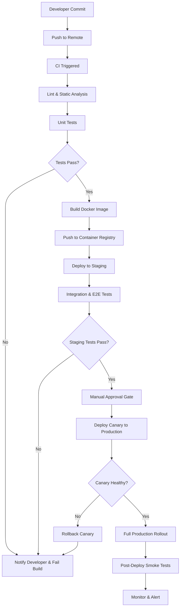

# Plan: Deployment Pipeline -- CI/CD Flow from Commit to Production

## Context

This plan defines a CI/CD deployment pipeline that automates the journey from developer commit to production release. The pipeline enforces quality gates at each stage: linting and unit tests run on every push, integration tests gate staging deploys, and manual approval plus canary analysis gate production promotion. The goal is a reliable, repeatable deployment flow with fast feedback and safe rollback.

## Key Steps

- **Lint & Unit Tests** -- Run on every push. Fast feedback loop; failures block the pipeline immediately.
- **Build & Push Image** -- A versioned Docker image is built and stored in the container registry only after tests pass.
- **Staging Deploy + Integration Tests** -- The image is deployed to a staging environment where integration and end-to-end tests validate behavior against real dependencies.
- **Manual Approval Gate** -- A human reviewer confirms readiness before any production traffic is affected.
- **Canary Deployment** -- A small percentage of production traffic is routed to the new version. Metrics (error rate, latency, CPU) are monitored for anomalies.
- **Full Rollout** -- If the canary is healthy, traffic is shifted fully to the new version. Post-deploy smoke tests and alerting confirm stability.
- **Rollback** -- At any failure point (tests, canary health), the pipeline halts, rolls back if needed, and notifies the developer.
