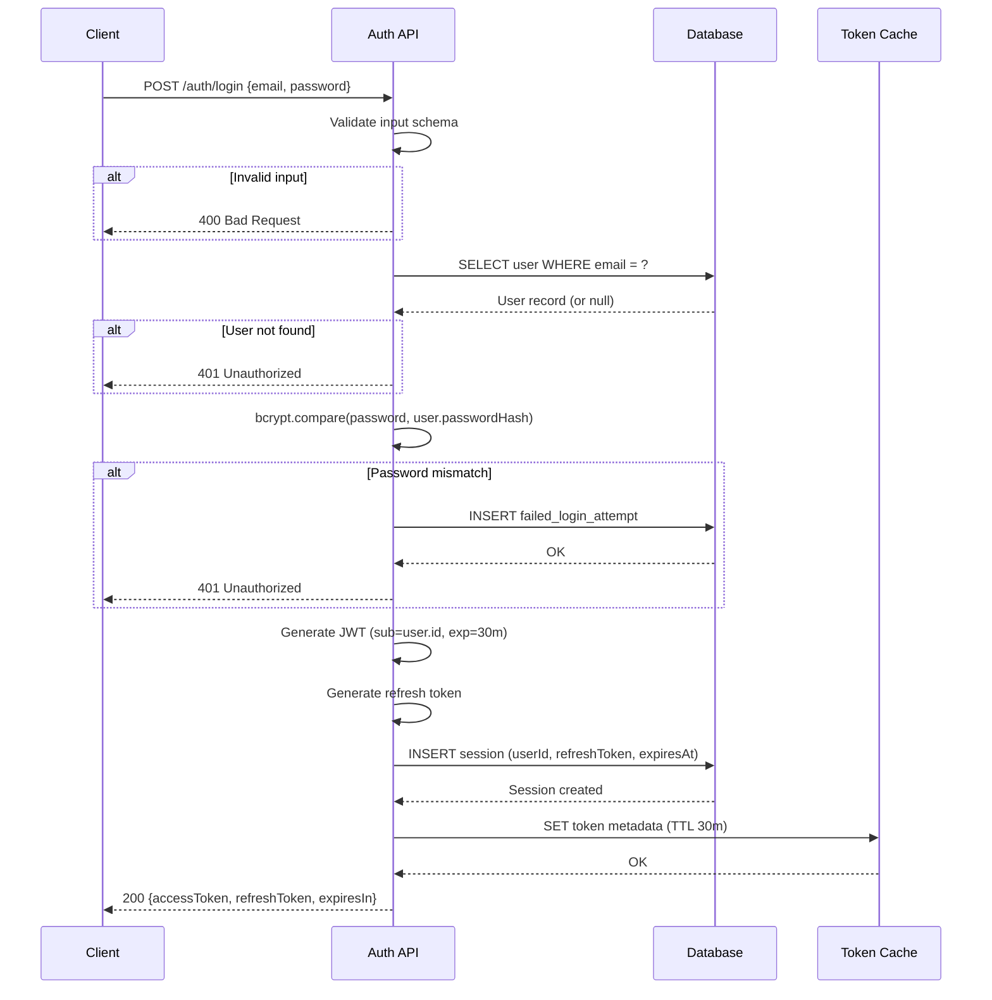

# Plan: Auth API Login Interaction

## Context

A user submits credentials (email + password) to the Auth API. The API must validate the input, query the database for the user record, verify the password hash, generate a JWT token on success, and return the appropriate response. This plan traces the interaction between the client, the Auth API, and the database during a login request.

## Key Steps

- **Input validation** -- reject malformed requests before touching the database.
- **User lookup** -- single indexed query on the `email` column; returns early with a generic 401 if the user does not exist.
- **Password verification** -- uses `bcrypt.compare` against the stored hash; never stores or logs the plaintext password.
- **Failed-attempt tracking** -- writes a `failed_login_attempt` row so rate-limiting and account-lockout policies can be enforced.
- **Token generation** -- produces a short-lived JWT access token (30 min) and a longer-lived refresh token; both are returned to the client.
- **Session persistence** -- the refresh token and its expiry are stored in a `sessions` table so the server can revoke tokens.
- **Cache write** -- token metadata is cached to allow fast validation on subsequent API calls without a DB round-trip.
