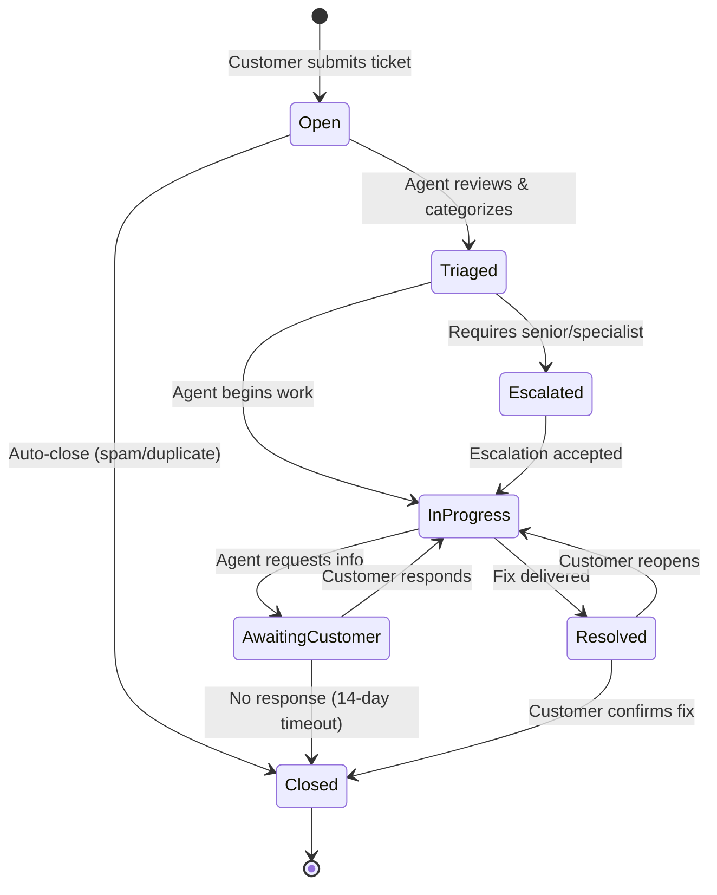

# Plan: Support Ticket Lifecycle

## Context

A support ticket moves through a well-defined set of states from the moment a customer opens it to its final resolution. Each transition is triggered by an action from either the customer, a support agent, or an automated system rule. The goal is to model every valid state and transition so that the ticketing system enforces correct workflow, prevents invalid jumps, and provides clear status visibility to all stakeholders.

## Key Design Points

- **Open** is the only entry state; every ticket starts here upon customer submission.
- **Triaged** acts as a gate -- no work begins until an agent has categorized priority, type, and assignment.
- **Escalated** is a dedicated state rather than a flag, making it visible in dashboards and SLA tracking.
- **AwaitingCustomer** pauses the SLA clock and starts a 14-day auto-close timer to prevent stale tickets.
- **Resolved** is distinct from **Closed** -- the customer has a window to confirm the fix or reopen before the ticket finalizes.
- **Closed** is the terminal state.
