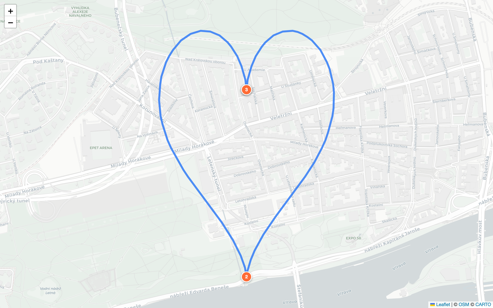

# Ghost Tracks v3

**Turn words into runnable art.** Describe a shape, get a GPS route you can actually run on real streets.

<p align="center">
  
  <br />
  <em>"a heart" &rarr; 4.2 km route through Vinohrady, Prague</em>
</p>

---

## What is this?

Ghost Tracks takes a natural language description like **"a heart"**, **"letter M"**, or **"a star"** and generates a real, runnable GPS route shaped like that object on actual city streets. Export it as GPX, load it into Strava, and go run your art.

The shape generation pipeline:

```
"a heart" → control points → scale to neighborhood → snap to streets → validate similarity → GPX
```

## Features

### Three Modes

| Mode | What it does |
|------|-------------|
| **Generate** | Pick a Prague neighborhood, get AI-generated shape ideas with difficulty ratings |
| **Describe** | Type any shape description, get a route immediately |
| **Explore** | Drop a pin anywhere on the map, check if your shape is feasible there |

### Shape Feasibility Engine

The Explore mode answers: **"Can I run this shape _here_?"**

- Binary YES/NO at a 90% similarity threshold
- Score breakdown: Hausdorff distance (55%), Ordered Sampling (35%), Raster IoU (10%)
- Suggests nearest neighborhoods where the shape _does_ work
- Shows feasibility across cities worldwide (Berlin, NYC, London, Barcelona, Tokyo)
- **Progressive disclosure** -- compact result first, expand for alternatives, expand again for full score breakdown

### Route Output

- Similarity score badge with color coding (green/yellow/red)
- Turn-by-turn waypoint directions
- GPX export for Strava/Garmin/Wahoo
- Alternative neighborhood suggestions
- Toggle between path-only and marker views

## Architecture

```
                    Browser (:8910)
                         |
              +----------+----------+
              |                     |
         React + Leaflet    RedwoodJS GraphQL
         (CartoDB Positron)     API (:8911)
                                    |
                              Python FastAPI
                              Microservice (:8000)
                                    |
                    +-------+-------+-------+
                    |       |       |       |
                 Shapes  Street   Shape  Feasibility
                Templates Mapper Validator  Engine
```

**Frontend:** React, TailwindCSS, Leaflet + CartoDB Positron tiles, glass morphism UI

**API Gateway:** RedwoodJS (GraphQL, Prisma ORM, SQLite)

**Shape Engine:** Python FastAPI with segment-wise street mapping algorithm

## Quick Start

### Prerequisites

- Node.js 20.x (RedwoodJS requirement)
- Python 3.12+
- Yarn 4.x

### 1. Start the Python backend

```bash
cd ../ghost-tracks/backend
python -m venv .venv && source .venv/bin/activate
pip install -r requirements.txt
uvicorn main:app --reload --port 8000
```

### 2. Start the RedwoodJS app

```bash
cd ghost-tracks-v3
yarn install
yarn rw prisma migrate dev
yarn rw dev
```

Open [localhost:8910](http://localhost:8910) -- the map loads immediately with CartoDB tiles (no API key needed).

### Environment Variables

```bash
# .env
DATABASE_URL=file:./dev.db
PYTHON_SERVICE_URL=http://localhost:8000

# Optional: Google Maps (Leaflet works without any keys)
GOOGLE_MAPS_API_KEY=your_key_here
```

## Algorithm: Segment-Wise Street Mapping (Variant E)

The winning algorithm from our [shape-routing experiment](../experiments/shape-routing-algorithms/):

1. Generate 128 control points for the target shape
2. Scale control points to fit the target neighborhood bounding box
3. **Split into 6 equal arc-length segments** (the key insight)
4. For each segment independently:
   - Densify to 50m spacing (tighter than baseline 80m)
   - Deduplicate within 10m (tighter than baseline 12m)
   - Snap to nearest walkable streets via OSRM
5. Stitch segments back together
6. Validate with blended similarity score

**Result:** 91.4% average similarity across 5 test shapes, beating 4 other variants.

### Scoring Formula

```
score = 0.55 * hausdorff + 0.35 * ordered_sampling + 0.10 * raster_iou
```

| Metric | Weight | What it measures |
|--------|--------|-----------------|
| Modified Hausdorff | 55% | Maximum deviation from target shape |
| Ordered Sampling | 35% | Point-by-point path fidelity |
| Raster IoU | 10% | Visual overlap when rasterized |

## Testing

**122+ tests** across 4 frameworks:

| Framework | Tests | What's covered |
|-----------|-------|---------------|
| **pytest** | 50 | Python shape generation, street mapping, validation, feasibility |
| **Playwright** | 43 | Full E2E flows -- describe, generate, explore, map rendering |
| **Cypress** | 20 | App shell, mode switching, GraphQL integration |
| **Jest** | 9 | RedwoodJS services, GraphQL resolvers, auth directives |

```bash
# Run everything
cd ../ghost-tracks/backend && pytest                    # Python
cd ghost-tracks-v3 && yarn rw test                      # Jest
npx playwright test                                     # Playwright
npx cypress run                                         # Cypress
```

## Tech Stack

| Layer | Technology |
|-------|-----------|
| Framework | [RedwoodJS](https://redwoodjs.com) 8.9 (React + GraphQL + Prisma) |
| Maps | [Leaflet](https://leafletjs.com) + [CartoDB Positron](https://carto.com/basemaps/) tiles |
| Styling | [TailwindCSS](https://tailwindcss.com) 3.4 + glass morphism |
| Database | SQLite (dev) via Prisma ORM |
| Shape Engine | Python [FastAPI](https://fastapi.tiangolo.com) |
| Testing | Playwright, Cypress, Jest, pytest |
| GPX Export | Client-side generation, download as file |

## Project Structure

```
ghost-tracks-v3/
  api/
    db/schema.prisma          # User, City, Neighborhood, GhostRoute, Favorite
    src/
      graphql/                # SDL type definitions
      services/ghostRoutes/   # Resolvers proxying to Python backend
      lib/pythonService.ts    # HTTP client for Python microservice
  web/
    src/
      components/
        LeafletMap/           # Map rendering with CartoDB tiles
        DescribePanel/        # NLP shape input
        GeneratePanel/        # Neighborhood-based idea generation
        FeasibilityPanel/     # Progressive disclosure feasibility UI
        RouteInstructions/    # Route details + GPX export
        ModeSwitcher/         # Generate / Describe / Explore tabs
        PinDropOverlay/       # "Tap the map" instruction overlay
        Toast/                # Notification system
      pages/HomePage/         # Main page orchestrating all modes
  tests/e2e/                  # Playwright specs
  cypress/e2e/                # Cypress specs
```

## Roadmap

- [ ] User accounts with dbAuth
- [ ] Saved routes + favorites
- [ ] Multi-city expansion via Google Places API
- [ ] Strava OAuth -- import runs, compare with ghost track
- [ ] PWA + offline GPX loading

## Credits

Built on top of the original [ghost-tracks](../ghost-tracks/) SvelteKit prototype. Part of the [autoresearch-playground](https://github.com/stussysenik/autoresearch) experiment collection.

Map tiles by [CARTO](https://carto.com/basemaps/) via [OpenStreetMap](https://www.openstreetmap.org/copyright).
