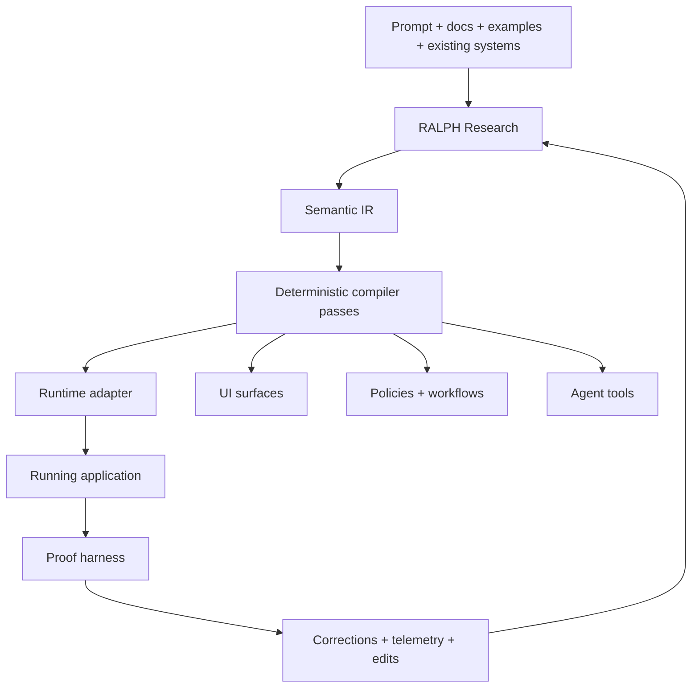

## Context

`autoresearch-playground` began as an autonomous experimentation repo and already contains a general experiment framework. The next coherent step is not "build another database." It is to define an **application OS** that can understand a domain, compile it into working software, verify the result, and improve over time.

The user goal is broader than internal tools but narrower than "all software immediately." The first real wedge is software whose behavior is dominated by **state, constraints, workflows, permissions, and views**. That class includes approvals, CRM-like systems, back-office flows, knowledge/work management, admin tools, and agent control planes.

Deep systems knowledge still matters. Browser engines, renderers, databases, and kernels all solve versions of the same hard problems:

- representing state compactly
- scheduling recomputation
- routing events and effects
- isolating capabilities
- managing resource lifetime
- replaying and recovering from failure

The proposal adopts those abstractions, but it does not force v1 to own a browser engine or a storage engine.

## Goals / Non-Goals

**Goals:**
- Define a compact semantic kernel that is inspectable, editable, and compilable
- Treat natural language as an input to the IR, not the runtime representation
- Make proof and replay first-class through a benchmark harness
- Start with boring, reliable runtime targets before owning low-level kernels
- Encode deep systems concepts where they matter: invalidation, scheduling, capability isolation, replay, and resource lifetimes
- Produce an implementation plan that fits the existing repo and can begin in small diffs

**Non-Goals:**
- Building a brand-new OLTP storage engine in v1
- Competing with general-purpose databases on raw storage features
- Generating arbitrary consumer software, games, or professional creative tools in the first release
- Putting an LLM in the critical path of normal reads and writes
- Replacing the repo's existing experiment framework

## Decisions

### Decision 1: Put a semantic kernel above storage

**Choice**: The system's center is a compact semantic IR, not tables, prompts, or generated code.

**Core primitives**:
- `Concept`
- `Entity`
- `Attribute`
- `Relation`
- `State`
- `Action`
- `Constraint`
- `Policy`
- `View`
- `Effect`
- `Artifact`
- `Provenance`

**Rationale**: This is the smallest stable layer that can survive regeneration, human edits, migrations, and multiple runtime targets. It also matches the user's interest in Common Lisp-like minimalism and strong meta-level structure.

### Decision 2: RALPH is the system loop

**Choice**: Formalize the loop as:
- `Research`
- `Abstract`
- `Lower`
- `Prove`
- `Harvest`

**Rationale**: Current app builders often stop at generation. The missing leverage is the closed-loop system that can learn from benchmark results, failed workflows, migration diffs, and human correction.

### Decision 3: Start with adapter targets, not a new engine

**Choice**: Use a Convex-first runtime adapter, then add Postgres and DuckDB-class adapters.

**Rationale**: Convex already provides live queries, functions, reactivity, background work, and a shape that is friendly to AI-assisted development. Postgres remains the default relational substrate. DuckDB is valuable for local analysis, evaluation, and benchmark introspection. Owning storage too early would consume the roadmap without proving the semantic architecture.

### Decision 4: Keep compiler passes deterministic

**Choice**: LLMs can propose or repair models, but the compile path after IR materialization must be deterministic.

**Required passes**:
1. normalization
2. concept resolution
3. invariant completion
4. policy expansion
5. workflow graph lowering
6. storage plan generation
7. view generation
8. migration diffing
9. verification plan generation

**Rationale**: The system needs explainability, reproducibility, and replay. Deterministic passes are what make proof and debugging possible.

### Decision 5: Treat proof as a product surface

**Choice**: The harness is not just QA; it is part of the product.

**Harness responsibilities**:
- compile benchmark apps from canonical prompts
- replay scripted product changes
- verify permissions and invariants
- measure edit survival
- compare artifact complexity against outcome quality
- store corrections as reusable signal

**Rationale**: If the system cannot survive iterative change, it is not solving the real application problem.

### Decision 6: Borrow from engines and kernels at the abstraction level

**Choice**: Import the lessons, not the entire implementation burden.

**Adopted abstractions**:
- **invalidation** from render/layout engines
- **retained graphs** from scene/document systems
- **event routing** from UI runtimes
- **capability isolation** from kernels and process boundaries
- **snapshot + replay** from databases and stateful runtimes
- **resource handles and lifetimes** from graphics/runtime systems
- **work scheduling** from ECS/render pipelines and browser task queues

**Deferred**:
- custom compositor
- custom JS/wasm runtime
- custom GPU scheduler
- bespoke sync engine
- general-purpose browser embedding strategy

**Rationale**: This respects the user's systems-level ambition without collapsing the v1 scope.

### Decision 7: Make the first surface a semantic studio

**Choice**: The initial user experience is a studio where humans can inspect the model, generated artifacts, and proof results, then apply semantic edits.

**Studio panes**:
- domain graph
- generated app surfaces
- proof status, migrations, and diffs
- provenance and correction history

**Rationale**: Generated code alone is a dead end. The editable world model is the durable asset.

### Decision 8: Define a benchmark corpus before claiming generality

**Choice**: v1 success is measured against a fixed benchmark suite of business-software archetypes and change scripts.

**Initial corpus**:
- approvals
- vendor and invoice management
- issue tracking
- support queue
- contract lifecycle
- inventory operations
- onboarding workflow
- scheduling and dispatch
- budgeting and ledger review
- structured knowledge base

**Rationale**: Benchmarks keep the project honest and make progress measurable inside this repo's existing experimentation culture.

## Risks / Trade-offs

| Risk | Severity | Mitigation |
|------|----------|------------|
| Scope inflates from business systems to "all software" too early | High | Enforce benchmark corpus and runtime-target gates before adding new domains |
| IR becomes too abstract to compile well | High | Keep primitives small, require every primitive to lower into at least one target artifact |
| LLM output destabilizes the model | High | Use deterministic passes, provenance tracking, and explicit human approval points |
| Convex-first biases the architecture too heavily | Medium | Define a narrow adapter interface from day one and validate against a Postgres design sketch |
| Systems ambition drifts into storage-engine work | High | Treat engine replacement as a post-proof milestone only |
| Proof harness becomes expensive and slow | Medium | Start with compact benchmark fixtures and replay scripts before full end-to-end browser tests |

## Migration Plan

| Phase | Scope | Acceptance Criteria |
|-------|-------|-------------------|
| 1 | Define IR package and benchmark corpus | 3 canonical apps compile into inspectable IR with stable diffs |
| 2 | Build deterministic compiler and Convex-first adapter | One benchmark app runs end-to-end with schema, functions, policies, and views |
| 3 | Add proof harness and change replay | The system survives 10 scripted product changes without semantic drift |
| 4 | Add semantic studio editing loop | Human edits modify the model, recompile safely, and preserve provenance |
| 5 | Add second adapter and concept library | Same benchmark app lowers to a second substrate with comparable semantics |

## Open Questions

1. How much of collaborative/local-first behavior belongs in v1 versus a later sync-focused runtime?
2. Should workflows lower to statecharts directly, or to a more generic event/effect graph with statechart projections?
3. What is the minimum render/effect abstraction needed to support richer interactive systems later without polluting v1?
4. Which benchmark should be the single forcing function for the first 90 days: approvals, issue tracking, or contract lifecycle?
5. How should the repo separate "semantic truth" from generated code once implementation begins?
