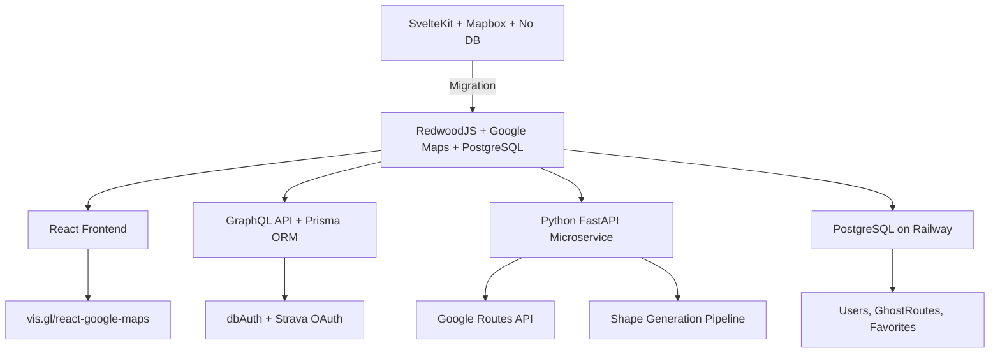

## Context

Ghost Tracks is a Strava art route planner (SvelteKit + Python FastAPI + Mapbox). Users describe a shape in natural language, the app generates a runnable route on real streets that traces that shape. The current stack lacks: database persistence, user authentication, ORM, and multi-city support -- routes are ephemeral and limited to Prague. Shape fidelity sits at ~87%, which is insufficient for complex curves like hearts and stars. This migration moves the entire stack to RedwoodJS + Google Maps Platform + Railway, addressing every gap in one coherent effort.

## Goals / Non-Goals

**Goals:**
- Unified full-stack JS/TS framework (RedwoodJS) with React, GraphQL, Prisma
- Replace Mapbox with Google Maps Platform (Maps JS API, Routes API, Places API)
- Add PostgreSQL persistence, user auth (dbAuth), saved routes, favorites
- Improve shape fidelity (heart >= 90%, star >= 85%, circle >= 88%)
- Multi-city worldwide support via Google Places
- Strava OAuth integration for direct GPX export
- Deploy on Railway (RedwoodJS + Python + PostgreSQL)
- O(1) GPU-accelerated map rendering, parallel chunk routing

**Non-Goals:**
- Rewriting the Python shape generation pipeline in TypeScript
- PostGIS spatial queries (JSON columns sufficient for v3)
- Real-time collaboration or multiplayer features
- Mobile native app (PWA only)
- Replacing the ZhipuAI GLM-4-plus LLM provider

## Decisions

### Decision 1: Keep Python microservice, don't port to TypeScript

**Choice**: Keep Python FastAPI as-is, call from RedwoodJS via HTTP

**Alternatives considered**:
- (A) Port everything to TypeScript -- single runtime, simpler deployment
- (B) Hybrid port -- move templates to TS, keep DSPy/NumPy in Python

**Rationale**: The Python service contains 3000+ lines of tested code with DSPy prompt chains, NumPy-based Hausdorff distance validation, and parametric shape templates. Rewriting risks shape fidelity regressions with no user-facing benefit. Python stays self-contained: description in, routed coordinates out. The service boundary is clean and stable.

### Decision 2: Google Routes API called from Python (not RedwoodJS)

**Choice**: Python service calls Google Routes API directly

**Alternatives considered**:
- RedwoodJS proxy pattern (mirroring current SvelteKit approach where the frontend proxies API calls)

**Rationale**: Eliminates a circular dependency where Python would need to call back through RedwoodJS to reach the routing API. The Python pipeline already handles waypoint chunking, densification, deduplication, and the tight control-point -> street-snap -> validate -> retry loop. Keeping routing calls in the same process avoids serverless function timeout risks for long routing chains and reduces network hops.

### Decision 3: @vis.gl/react-google-maps for map rendering

**Choice**: vis.gl library (Google-sponsored, declarative React components)

**Alternatives considered**:
- (A) `@googlemaps/react-wrapper` -- thin wrapper, manual imperative code
- (B) Raw JS loader -- maximum control, no abstraction

**Rationale**: Provides `<Map>`, `<Polyline>`, `<AdvancedMarker>` as first-class React components with a 1:1 mapping from current Mapbox patterns. TypeScript-first with full type coverage. `useMap()` hook enables imperative access when needed (e.g., fitBounds after route generation). Google-maintained, so API surface tracks Maps JS API releases.

### Decision 4: dbAuth for authentication

**Choice**: RedwoodJS built-in dbAuth (cookie-based, bcrypt-hashed credentials in PostgreSQL)

**Alternatives considered**:
- (A) Clerk -- managed auth, $25/mo at scale
- (B) Auth0 -- enterprise-grade, complex setup and callback flows

**Rationale**: Zero cost, no external dependencies, and credentials live in the same PostgreSQL instance. Strava OAuth is a separate "link account" flow that works identically regardless of which primary auth provider is used. dbAuth ships with RedwoodJS scaffolding, reducing integration effort to near zero.

### Decision 5: GhostRoute naming convention

**Choice**: Use "GhostRoute" (not "Route") throughout the GraphQL schema and Prisma models

**Rationale**: "Route" collides with RedwoodJS's router concept (`<Route>`, `routes.ts`, `useRoute`). Using "GhostRoute" prevents confusion in code, docs, and developer conversation. It also reinforces the product identity.

### Decision 6: Railway for deployment

**Choice**: Railway with 3 services (RedwoodJS web+api, Python FastAPI, PostgreSQL)

**Alternatives considered**:
- (A) Vercel (frontend) + Fly.io (Python) -- split management, two billing systems
- (B) AWS ECS -- powerful but heavy operational overhead for a side project
- (C) Render -- similar to Railway but less RedwoodJS community adoption

**Rationale**: Railway's internal networking gives zero-latency service-to-service calls (Python <-> RedwoodJS communicate over private network). Managed PostgreSQL with automatic backups. Both application services live in one Railway project with unified logging and env var management. The user specified Railway as the preferred target.

### Decision 7: Curvature-adaptive densification for shape fidelity

**Choice**: Variable densification based on local curvature analysis

**Alternatives considered**:
- (A) Uniform densification at current density (status quo ~87%)
- (B) Higher uniform density everywhere (wastes waypoints on straight segments)

**Rationale**: High-curvature sections (heart lobes, star points) need dense control points (~40m spacing) to preserve the curve through street-snapping. Straight sections can be sparser (~120m spacing) without losing shape. This reduces total waypoint count while concentrating precision where it matters most. Combined with 128-point templates (up from 64), this targets heart >= 90% Hausdorff similarity.

### Decision 8: Parallel chunk routing via asyncio.gather

**Choice**: Fire all routing chunks concurrently using `asyncio.gather`

**Alternatives considered**:
- (A) Sequential routing (current) -- simple but slow
- (B) Batched (3 at a time) -- compromise between rate limits and speed

**Rationale**: Route chunks are independent (each covers a segment of the shape). Concurrent execution reduces total routing time from `sum(chunk_times)` to `max(chunk_time)`. Expected improvement: ~2-5s total vs current ~6-15s for a heart shape. Google Routes API rate limits (3000 RPM) are well above what a single route generation needs (~10-20 chunks).

## Risks / Trade-offs

| Risk | Severity | Mitigation |
|------|----------|------------|
| Google Routes API produces different walking paths than Mapbox Directions | High | Run 5 canonical shapes (heart, star, circle, arrow, spiral) through both APIs during Phase 1. Tune densify/dedup thresholds. The existing validation + retry loop is the safety net. |
| AdvancedMarkerElement requires a Map ID from Google Cloud Console | Low | Create Map ID upfront in Cloud Console during project setup. Fallback to basic `Marker` if Map ID is misconfigured. |
| Google Maps $200/mo free credit may not cover high usage | Medium | Use field masks on all API calls to reduce billing. Cache route results in PostgreSQL. Set billing alerts at $50 increments. Monitor per-session Places Autocomplete cost. |
| Python + Node.js dual runtime adds deployment complexity | Medium | Railway internal networking makes inter-service calls feel local. Python service is stable and rarely changes -- it has a narrow API surface (one endpoint). Docker images are cached. |
| SvelteKit to React rewrite loses Svelte 5 reactivity patterns | Medium | RedwoodJS Cells provide equivalent loading/error/success/empty state management. React hooks (`useState`, `useEffect`, `useQuery`) replace Svelte stores. Component count is small (6 components + 5 pages). |
| Places Autocomplete cost per keystroke | Medium | Use session tokens to group autocomplete requests into sessions ($2.83/1000 sessions instead of per-keystroke billing). Cache results for repeat city searches. Debounce input to 300ms. |

## Migration Plan

Six independently deployable phases, each with a clear acceptance gate:

| Phase | Scope | Acceptance Criteria |
|-------|-------|-------------------|
| 1 | RedwoodJS scaffold + Google Maps rendering + Python proxy service | Feature-parity with v2.1: user describes a shape, sees a route on a Google Map. No regressions. |
| 2 | Prisma DB schema + dbAuth + saved routes + favorites | Users can sign up, log in, save routes, mark favorites. Routes persist across sessions. |
| 3 | Shape fidelity improvements + parallel routing | Heart >= 90% Hausdorff similarity. Route generation completes in < 10s. |
| 4 | Multi-city via Google Places Autocomplete | Users can generate shapes in 5+ cities worldwide. City/neighborhood selection works. |
| 5 | Strava OAuth + GPX export | Users can link their Strava account and export a generated route directly to Strava. |
| 6 | Polish: PWA manifest, OG image generation, public gallery, rate limiting | App passes Lighthouse PWA audit. Shared route URLs render OG preview images. |

**Rollback strategy**: Each phase is a separate Railway deployment. Roll back by reverting to the previous deployment snapshot. No phase depends on irreversible data migrations (Phase 2 creates tables but doesn't migrate existing data -- there is none).

## Open Questions

1. **Google Maps API rate limits**: What are the exact rate limits on the demo/free-tier API key? Need to verify Routes API and Places API quotas before committing to production use patterns.
2. **LLM fallback provider**: ZhipuAI GLM-4-plus is the current LLM for shape interpretation. Should we add Claude (via `claude -p`) as a fallback provider in case of availability issues or for users outside China?
3. **Railway pricing at scale**: Will the 3-service architecture (RedwoodJS, Python, PostgreSQL) fit within Railway's hobby tier ($5/mo), or does it require the Pro plan ($20/mo)?
4. **Google Maps Map ID provisioning**: Should the Map ID be created per-environment (dev, staging, prod) or shared across environments with style variations?
